# Proxy Access Service

Веб-сервис прокси-доступа с регистрацией, личным кабинетом, одноразовыми ключами активации, desktop-клиентом и WebSocket-статусами подключения.

Проект реализован как тестовое задание для Python Web стажёра.

---

## Описание проекта

Сервис позволяет пользователю:

1. Зарегистрироваться на сайте.
2. Получить одноразовый activation key.
3. Войти в личный кабинет.
4. Скопировать activation key.
5. Вставить ключ в desktop-приложение.
6. Подключиться к свободному proxy / virtual machine.
7. Получать статус подключения через WebSocket.
8. Отключиться через desktop-приложение или личный кабинет.
9. Освободить proxy для других пользователей.

Основной сценарий:

```text
Регистрация → activation_key → Desktop → Backend → Proxy → WebSocket status → Disconnect
```

---

## Технологический стек

### Backend

- Python
- Django
- Django REST Framework
- Django ORM
- PostgreSQL
- Celery
- Redis
- Django Channels
- drf-spectacular
- Swagger / Redoc
- pytest
- pytest-django

### Frontend

- Vue 3
- Vuetify 3
- Vue Router
- Axios
- Vite

### Desktop

- Python
- Tkinter
- requests
- websocket-client

### Инфраструктура

- Docker
- Docker Compose

---

## Возможности

Реализовано:

- регистрация пользователя;
- вход по email и паролю;
- API token авторизация;
- личный кабинет;
- отображение текущего activation key;
- обновление activation key;
- смена пароля;
- одноразовая активация ключа;
- выдача первой свободной active virtual machine;
- блокировка занятых proxy;
- освобождение proxy при отключении;
- desktop-клиент;
- WebSocket-статусы подключения;
- история подключений через ConnectionSession;
- Django Admin для пользователей, proxy и сессий;
- Swagger-документация API;
- Docker Compose запуск;
- backend-тесты.

---

## Структура проекта

```text
proxy-access-service/
├── backend/
│   ├── config/
│   │   ├── settings.py
│   │   ├── urls.py
│   │   ├── asgi.py
│   │   ├── wsgi.py
│   │   └── celery.py
│   │
│   ├── users/
│   │   ├── models.py
│   │   ├── serializers.py
│   │   ├── views.py
│   │   ├── urls.py
│   │   ├── tasks.py
│   │   └── admin.py
│   │
│   ├── proxies/
│   │   ├── models.py
│   │   ├── serializers.py
│   │   └── admin.py
│   │
│   ├── connections/
│   │   ├── models.py
│   │   ├── serializers.py
│   │   ├── views.py
│   │   ├── urls.py
│   │   ├── consumers.py
│   │   ├── routing.py
│   │   └── admin.py
│   │
│   ├── tests/
│   │   ├── test_users_api.py
│   │   └── test_connections_api.py
│   │
│   ├── Dockerfile
│   ├── manage.py
│   ├── pytest.ini
│   └── requirements.txt
│
├── frontend/
│   ├── src/
│   │   ├── api/
│   │   │   └── api.js
│   │   ├── router/
│   │   │   └── index.js
│   │   ├── views/
│   │   │   ├── RegisterView.vue
│   │   │   ├── LoginView.vue
│   │   │   └── ProfileView.vue
│   │   ├── App.vue
│   │   └── main.js
│   │
│   ├── Dockerfile
│   └── package.json
│
├── desktop/
│   ├── main.py
│   └── requirements.txt
│
├── docker-compose.yml
├── .env.example
├── .gitignore
└── README.md
```

---

## Основные сущности

### User

Пользователь системы.

Основные поля:

```text
id
email
password
is_active
activation_key
activation_key_expires
created_at
updated_at
```

`activation_key` используется desktop-приложением для подключения к proxy.

Ключ является одноразовым. После успешной активации он удаляется.

---

### VirtualMachine

Виртуальная машина / proxy-сервер.

Основные поля:

```text
id
name
host
port
protocol
is_active
current_user
last_used_at
created_at
updated_at
```

Если `current_user` пустой, proxy считается свободным.

Если `current_user` заполнен, proxy занят пользователем.

---

### ConnectionSession

Сессия подключения desktop-клиента.

Основные поля:

```text
id
user
virtual_machine
token
status
created_at
updated_at
disconnected_at
```

`token` — это connection token, который desktop получает после успешной активации ключа.

Он нужен, чтобы desktop мог отключиться от proxy без API token пользователя.

---

## Важные типы ключей

В проекте есть три разных значения, которые нельзя путать.

### 1. API token

Выдаётся после логина:

```http
POST /api/auth/login/
```

Используется для личного кабинета и защищённых API-запросов.

Передаётся в заголовке:

```http
Authorization: Token <api_token>
```

Используется для:

```text
GET  /api/profile/
POST /api/profile/refresh-key/
POST /api/profile/change-password/
POST /api/disconnect/
```

---

### 2. activation_key

Создаётся после регистрации или обновления ключа.

Используется desktop-приложением для подключения к proxy.

Передаётся в теле запроса:

```json
{
  "activation_key": "<activation_key>"
}
```

Используется для:

```text
POST /api/activate-key/
```

После успешной активации удаляется.

---

### 3. connection_token

Создаётся после успешной активации `activation_key`.

Используется desktop-приложением для отключения от proxy.

Передаётся в теле запроса:

```json
{
  "connection_token": "<connection_token>"
}
```

Используется для:

```text
POST /api/desktop/disconnect/
```

---

## Запуск проекта

### 1. Клонировать репозиторий

```bash
git clone <repo-url>
cd proxy-access-service
```

---

### 2. Создать `.env`

Скопировать пример:

```bash
cp .env.example .env
```

На Windows PowerShell:

```powershell
copy .env.example .env
```

Для локального запуска можно оставить значения по умолчанию.

---

### 3. Запустить проект

```bash
docker compose up -d --build
```

После запуска будут доступны:

```text
Backend:  http://localhost:8000
Swagger:  http://localhost:8000/api/docs/
Redoc:    http://localhost:8000/api/redoc/
Admin:    http://localhost:8000/admin/
Frontend: http://localhost:5173
```

---

## Docker Compose сервисы

В проекте запускаются следующие сервисы:

```text
postgres  — база данных PostgreSQL
redis     — брокер для Celery и Channels
backend   — Django backend
celery    — Celery worker
frontend  — Vue frontend
```

Проверить состояние контейнеров:

```bash
docker compose ps
```

Ожидаемый результат:

```text
proxy_postgres   running
proxy_redis      running
proxy_backend    running
proxy_celery     running
proxy_frontend   running
```

---

## Создание суперпользователя

```bash
docker compose run --rm backend python manage.py createsuperuser
```

После этого можно зайти в Django Admin:

```text
http://localhost:8000/admin/
```

---

## Создание тестовой виртуальной машины

Для проверки подключения нужно создать хотя бы один proxy.

Через админку:

```text
Admin → Proxies → Virtual machines → Add
```

Пример данных:

```text
name: proxy-1
host: 127.0.0.1
port: 1080
protocol: socks5
is_active: True
current_user: пусто
```

После сохранения эта виртуальная машина будет доступна для выдачи пользователям.

---

## Backend API

Swagger-документация доступна по адресу:

```text
http://localhost:8000/api/docs/
```

Redoc:

```text
http://localhost:8000/api/redoc/
```

---

### Регистрация

```http
POST /api/auth/register/
```

Пример запроса:

```json
{
  "email": "user@example.com",
  "password": "StrongPassword123",
  "password_confirm": "StrongPassword123"
}
```

Пример ответа:

```json
{
  "message": "Письмо с ключом отправлено на почту.",
  "user": {
    "id": 1,
    "email": "user@example.com",
    "activation_key": "..."
  }
}
```

После регистрации создаётся одноразовый `activation_key`.

---

### Вход

```http
POST /api/auth/login/
```

Пример запроса:

```json
{
  "email": "user@example.com",
  "password": "StrongPassword123"
}
```

Пример ответа:

```json
{
  "token": "api_token_here",
  "user": {
    "id": 1,
    "email": "user@example.com",
    "activation_key": "...",
    "connection_status": "disconnected",
    "active_proxy": null
  }
}
```

---

### Профиль пользователя

```http
GET /api/profile/
```

Требуется заголовок:

```http
Authorization: Token api_token_here
```

Пример ответа без активного подключения:

```json
{
  "id": 1,
  "email": "user@example.com",
  "activation_key": "activation_key_here",
  "activation_key_expires": "2026-05-08T12:00:00Z",
  "connection_status": "disconnected",
  "active_proxy": null,
  "created_at": "2026-05-01T12:00:00Z",
  "updated_at": "2026-05-01T12:00:00Z"
}
```

Пример ответа с активным подключением:

```json
{
  "id": 1,
  "email": "user@example.com",
  "activation_key": null,
  "activation_key_expires": null,
  "connection_status": "connected",
  "active_proxy": {
    "id": 1,
    "name": "proxy-1",
    "host": "127.0.0.1",
    "port": 1080,
    "protocol": "socks5",
    "last_used_at": "2026-05-01T12:10:00Z"
  },
  "created_at": "2026-05-01T12:00:00Z",
  "updated_at": "2026-05-01T12:00:00Z"
}
```

---

### Обновление activation key

```http
POST /api/profile/refresh-key/
```

Требуется заголовок:

```http
Authorization: Token api_token_here
```

Пример ответа:

```json
{
  "message": "Новый ключ создан и отправлен на почту.",
  "user": {
    "id": 1,
    "email": "user@example.com",
    "activation_key": "new_activation_key_here"
  }
}
```

---

### Смена пароля

```http
POST /api/profile/change-password/
```

Требуется заголовок:

```http
Authorization: Token api_token_here
```

Пример запроса:

```json
{
  "old_password": "OldPassword123",
  "new_password": "NewPassword123",
  "new_password_confirm": "NewPassword123"
}
```

Пример ответа:

```json
{
  "message": "Пароль успешно изменён."
}
```

---

### Активация ключа

```http
POST /api/activate-key/
```

Пример запроса:

```json
{
  "activation_key": "activation_key_here"
}
```

Пример успешного ответа:

```json
{
  "status": "connected",
  "user_id": 1,
  "connection_token": "connection_token_here",
  "proxy": {
    "id": 1,
    "name": "proxy-1",
    "host": "127.0.0.1",
    "port": 1080,
    "protocol": "socks5"
  }
}
```

Если ключ неправильный или уже использован:

```json
{
  "status": "error",
  "detail": "Ключ активации не найден или уже был использован."
}
```

Если свободных proxy нет:

```json
{
  "status": "no_free_vms",
  "detail": "Все прокси заняты. Попробуйте позже."
}
```

---

### Отключение через личный кабинет

```http
POST /api/disconnect/
```

Требуется заголовок:

```http
Authorization: Token api_token_here
```

Пример ответа:

```json
{
  "status": "disconnected",
  "detail": "Пользователь отключён от прокси.",
  "released_proxies": [
    {
      "id": 1,
      "name": "proxy-1",
      "host": "127.0.0.1",
      "port": 1080,
      "protocol": "socks5"
    }
  ]
}
```

---

### Отключение desktop-клиента

```http
POST /api/desktop/disconnect/
```

Пример запроса:

```json
{
  "connection_token": "connection_token_here"
}
```

Пример ответа:

```json
{
  "status": "disconnected",
  "detail": "Desktop-клиент отключился от прокси.",
  "released_proxy": {
    "id": 1,
    "name": "proxy-1",
    "host": "127.0.0.1",
    "port": 1080,
    "protocol": "socks5"
  }
}
```

---

## WebSocket

WebSocket endpoint:

```text
ws://localhost:8000/ws/status/{user_id}/
```

Пример:

```text
ws://localhost:8000/ws/status/1/
```

Сервер отправляет статусы:

```text
waiting
connected
disconnected
no_free_vms
error
```

Пример сообщения при подключении:

```json
{
  "status": "connected",
  "detail": "Пользователь уже подключён к прокси.",
  "proxy": {
    "id": 1,
    "name": "proxy-1",
    "host": "127.0.0.1",
    "port": 1080,
    "protocol": "socks5"
  }
}
```

Пример сообщения при отключении:

```json
{
  "status": "disconnected",
  "detail": "Desktop-клиент отключился от прокси.",
  "proxy": null
}
```

---

## Frontend

Frontend доступен по адресу:

```text
http://localhost:5173
```

Основные страницы:

```text
/register
/login
/profile
```

### Возможности frontend

- регистрация пользователя;
- вход пользователя;
- сохранение API token в localStorage;
- просмотр профиля;
- просмотр activation key;
- обновление activation key;
- отображение активного proxy;
- отключение от proxy;
- смена пароля.

---

## Desktop-приложение

Desktop-приложение находится в папке:

```text
desktop/
```

### Установка зависимостей

Перейти в папку desktop:

```bash
cd desktop
```

Создать виртуальное окружение:

```bash
python -m venv venv
```

Активировать окружение.

Windows PowerShell:

```powershell
.\venv\Scripts\activate
```

Установить зависимости:

```bash
pip install -r requirements.txt
```

Запустить приложение:

```bash
python main.py
```

---

### Как работает desktop

1. Пользователь вставляет `activation_key`.
2. Desktop отправляет запрос:

```text
POST /api/activate-key/
```

3. Backend возвращает:

```text
user_id
connection_token
proxy
```

4. Desktop подключается к WebSocket:

```text
ws://localhost:8000/ws/status/{user_id}/
```

5. Desktop показывает статус подключения.
6. При нажатии «Отключиться» desktop отправляет:

```text
POST /api/desktop/disconnect/
```

7. Backend освобождает proxy.

---

## Celery и отправка писем

Отправка activation key выполняется через Celery.

Для локальной разработки используется console email backend. Поэтому письма не отправляются на реальную почту, а выводятся в логи Celery.

Посмотреть логи:

```bash
docker compose logs -f celery
```

В логах можно увидеть письмо с activation key.

---

## Запуск тестов

Backend-тесты запускаются через pytest:

```bash
docker compose run --rm backend pytest -q
```

Текущий результат:

```text
21 passed
```

---

## Что покрыто тестами

Тестами покрыты:

- успешная регистрация пользователя;
- регистрация с повторным email;
- регистрация с несовпадающими паролями;
- логин и получение API token;
- запрет доступа к профилю без token;
- получение профиля авторизованного пользователя;
- отображение `active_proxy` в профиле;
- обновление activation key;
- запрет refresh-key без авторизации;
- смена пароля;
- успешная активация ключа;
- создание ConnectionSession;
- назначение свободной virtual machine;
- удаление activation key после активации;
- запрет повторного использования activation key;
- запрет использования истёкшего activation key;
- ошибка при отсутствии свободных proxy;
- запрет выдачи inactive virtual machine;
- отключение через личный кабинет;
- отключение desktop-клиента по connection token;
- ошибка при неверном connection token;
- запрет повторного disconnect по тому же connection token;
- гарантия, что один пользователь не занимает несколько proxy одновременно.

---

## Сценарий ручной проверки

### 1. Запустить проект

```bash
docker compose up -d --build
```

### 2. Создать суперпользователя

```bash
docker compose run --rm backend python manage.py createsuperuser
```

### 3. Создать proxy

Открыть:

```text
http://localhost:8000/admin/
```

Создать `VirtualMachine`:

```text
name: proxy-1
host: 127.0.0.1
port: 1080
protocol: socks5
is_active: True
current_user: пусто
```

### 4. Зарегистрировать пользователя

Открыть:

```text
http://localhost:5173/register
```

### 5. Войти в личный кабинет

Открыть:

```text
http://localhost:5173/login
```

### 6. Скопировать activation key

Открыть:

```text
http://localhost:5173/profile
```

Скопировать текущий `activation_key`.

### 7. Запустить desktop

```bash
cd desktop
python main.py
```

### 8. Вставить activation key

После подключения desktop должен показать:

```text
Статус: connected
Назначенный proxy
host
port
protocol
```

### 9. Проверить админку

В админке должно быть видно:

```text
VirtualMachine.current_user заполнен
ConnectionSession status=connected
```

### 10. Отключиться через desktop

После отключения:

```text
VirtualMachine.current_user пустой
ConnectionSession status=disconnected
```

---

## Демонстрация работы

В проекте приложены скриншоты, демонстрирующие основные сценарии работы сервиса: запуск контейнеров, регистрацию пользователя, отправку ключа через Celery, работу личного кабинета, подключение через desktop-приложение, обработку ошибки при отсутствии свободных прокси, административную панель и запуск тестов.

### 1. Запуск проекта через Docker Compose

Проект запускается одной командой через Docker Compose. После запуска поднимаются контейнеры backend, frontend, PostgreSQL, Redis и Celery worker.

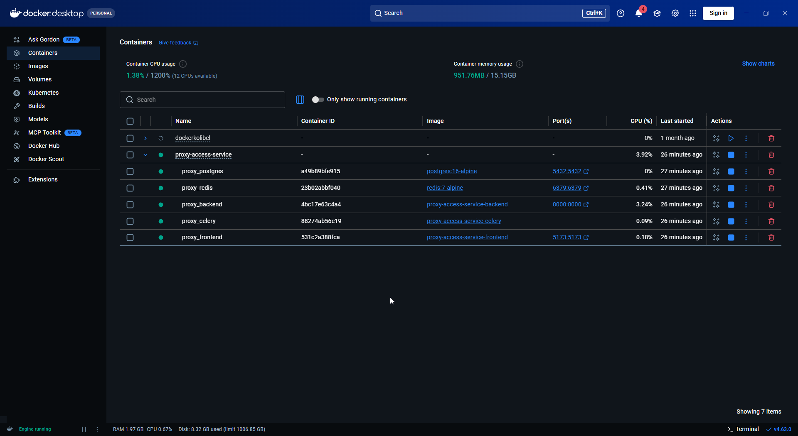

### 2. Документация API

API документируется автоматически через Swagger. В документации доступны основные endpoints для регистрации, авторизации, работы с профилем, обновления ключа, активации ключа и отключения от прокси.

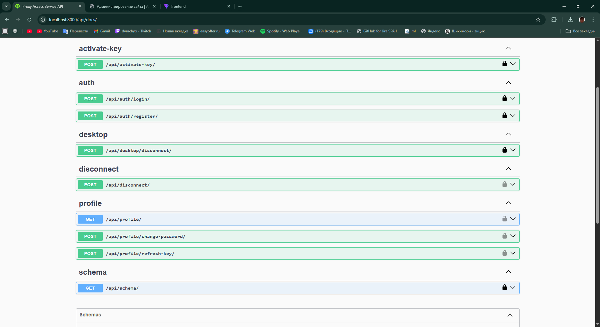

### 3. Регистрация пользователя

Пользователь может зарегистрироваться через веб-интерфейс, указав email, пароль и подтверждение пароля.

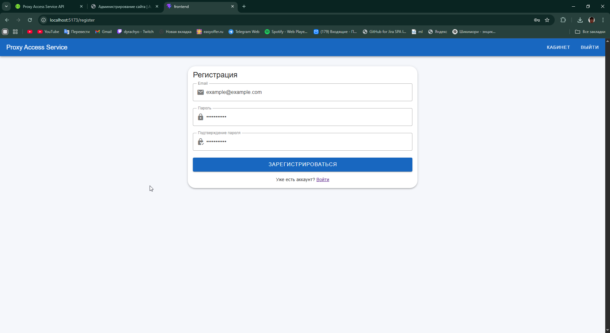

После успешной регистрации пользователь получает сообщение о создании аккаунта и отправке ключа активации.

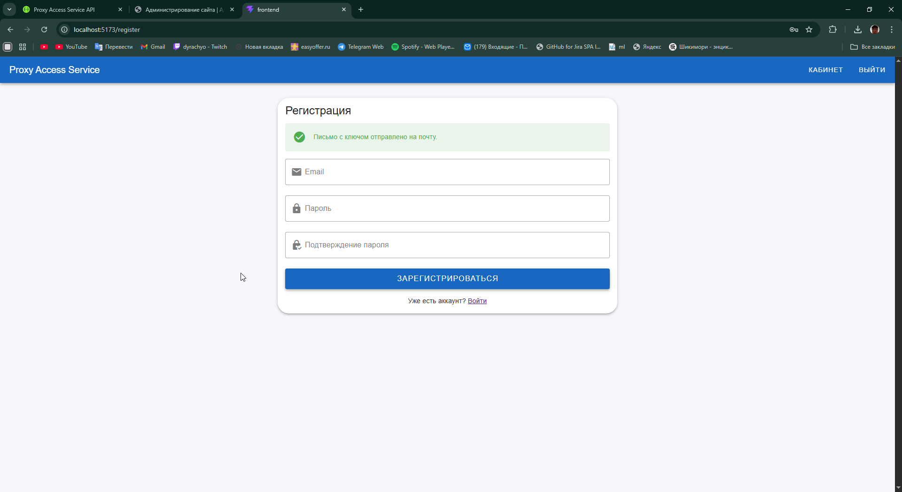

### 4. Отправка ключа активации через Celery

После регистрации или обновления ключа создаётся асинхронная задача Celery. Для демонстрации используется console email backend, поэтому письмо с ключом выводится в логах контейнера Celery.

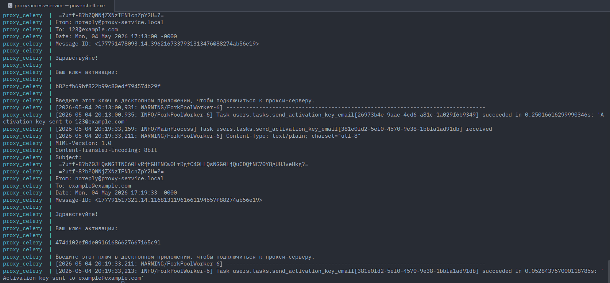

### 5. Авторизация пользователя

Пользователь может войти в систему через страницу авторизации.

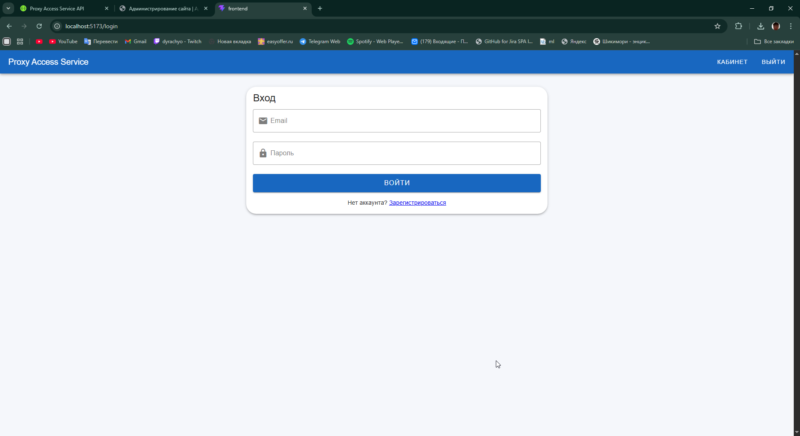

### 6. Личный кабинет пользователя

В личном кабинете отображается информация о пользователе, текущий ключ активации, форма обновления ключа и форма смены пароля.

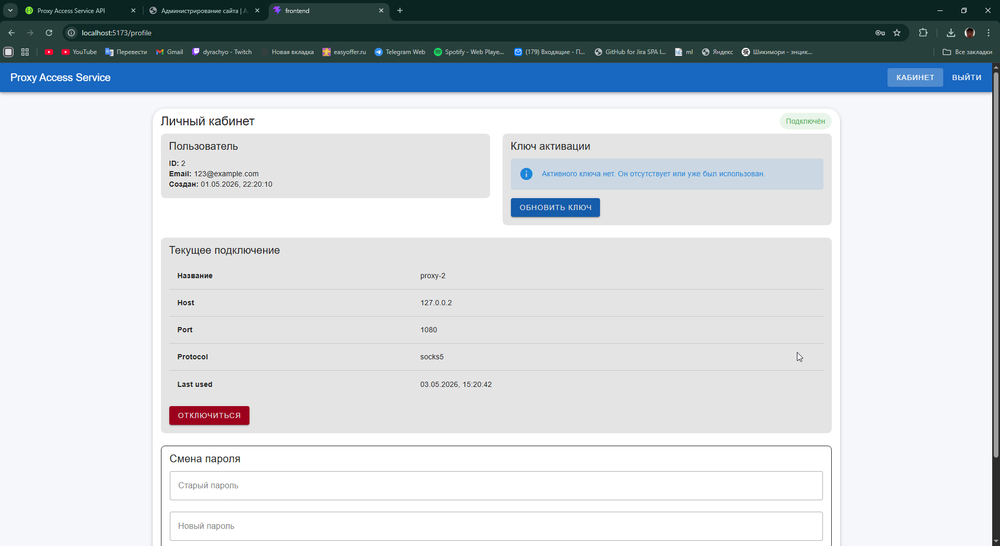

### 7. Обновление ключа активации

Пользователь может обновить ключ активации. Старый ключ становится недействительным, а новый ключ сохраняется в профиле и отправляется пользователю.

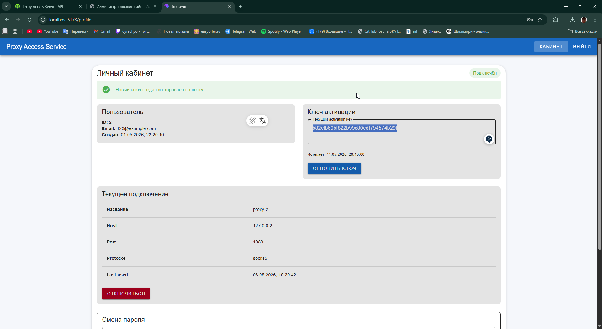

### 8. Смена пароля

В личном кабинете реализована смена пароля. При некорректных данных пользователь получает сообщение об ошибке.

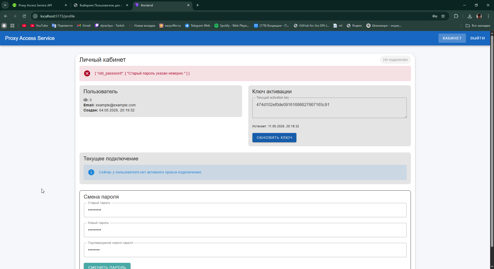

При корректном вводе старого и нового пароля пароль успешно изменяется.

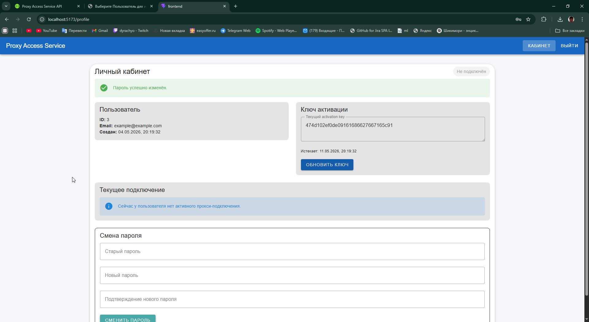

### 9. Desktop-приложение

Desktop-приложение позволяет пользователю ввести ключ активации и подключиться к свободной виртуальной машине-прокси.

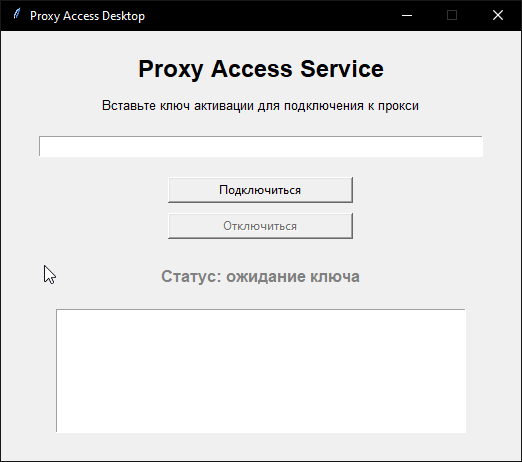

После успешной активации ключа backend возвращает данные свободной виртуальной машины, а desktop-клиент отображает статус подключения.

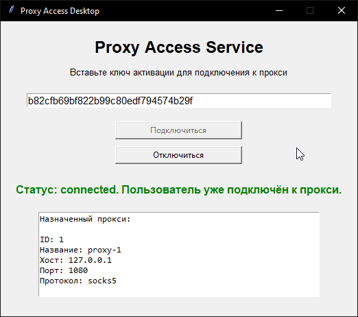

Если свободных виртуальных машин нет, пользователь получает понятную ошибку.

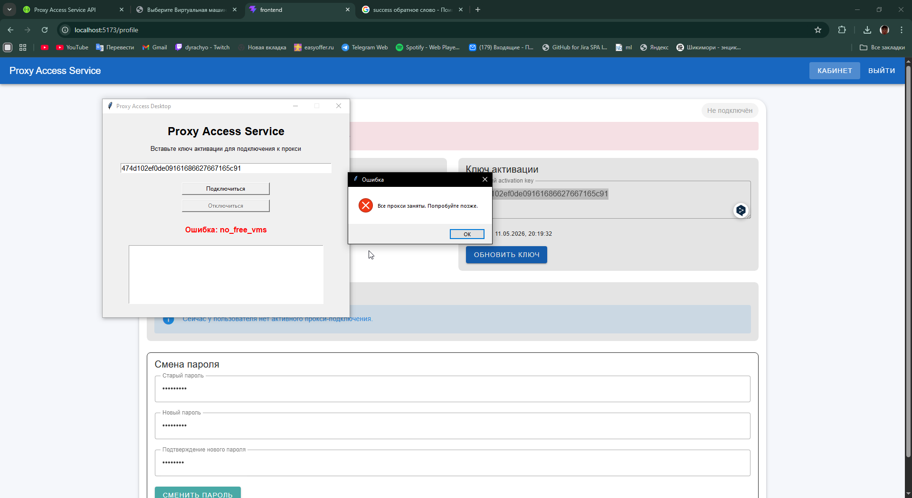

### 10. Административная панель Django

В административной панели можно просматривать и управлять пользователями, виртуальными машинами и историей подключений.

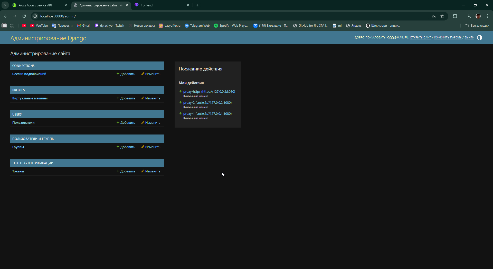

Список зарегистрированных пользователей:

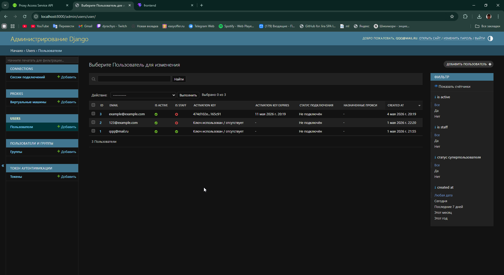

История подключений пользователей к прокси:

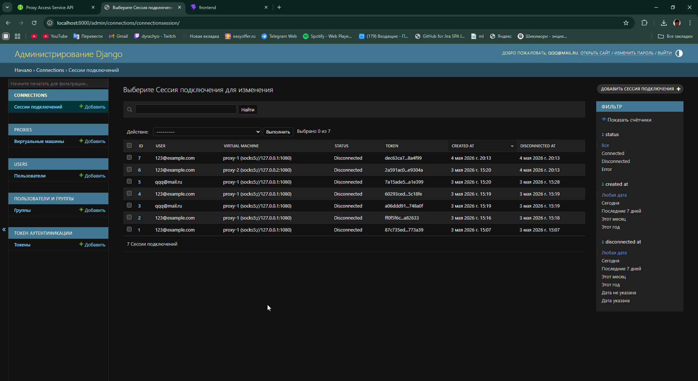

### 11. Backend-тесты

Backend покрыт тестами. Тесты проверяют регистрацию, авторизацию, работу ключей активации, распределение виртуальных машин, обработку ошибок и освобождение прокси.

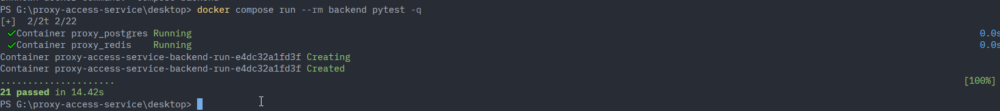
